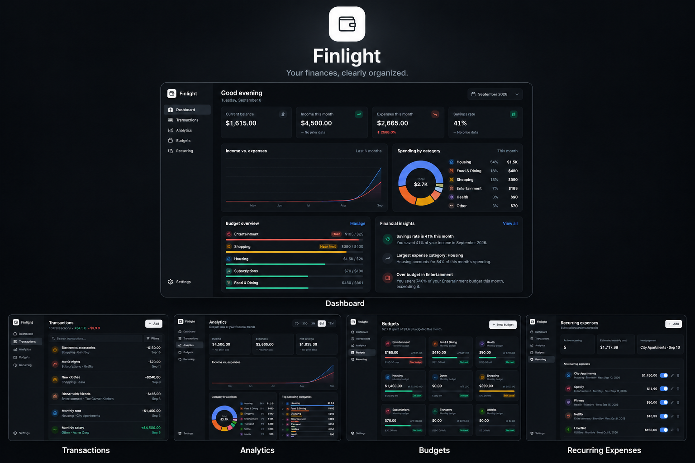
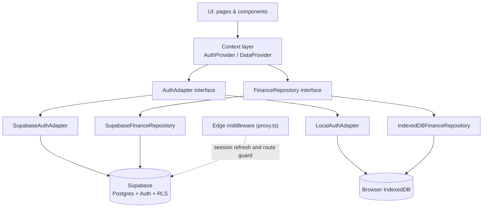

<p align="center">
  <a href="https://finlightapp.vercel.app">
    <strong>Live Demo → finlightapp.vercel.app</strong>
  </a>
</p>

<p align="center">
  
</p>

<p align="center">
  A fully responsive personal finance application, live on the web and optimized for both desktop and mobile.
</p>

# Finlight

A real, authenticated personal finance web app — track transactions, set monthly budgets, and understand your spending, backed by Supabase (PostgreSQL + Auth) with Row Level Security enforcing per-user data isolation.
# Finlight

A real, authenticated personal finance web app — track transactions, set monthly budgets, and understand your spending, backed by Supabase (PostgreSQL + Auth) with Row Level Security enforcing per-user data isolation.

## Overview

Finlight is a multi-user personal finance tracker built with Next.js and Supabase. Users register with an email and password, and from there can log income and expenses, set monthly budgets per category, track recurring bills and subscriptions, and see where their money goes through a dashboard, category breakdowns, and trend charts.

It solves the same problem as a basic spreadsheet budget — "where did my money go, and am I staying within my limits?" — but as a proper multi-user application: every account is authenticated, every user's financial data lives in its own isolated set of rows in a real Postgres database, and nothing is shared, mocked, or reset between sessions. There is no seeded demo data; a new account starts completely empty and only ever shows what that user has actually entered.

This makes it useful for anyone who wants a straightforward, private way to track personal spending and budgets without a spreadsheet, and it's built the way a small production SaaS product would be: authenticated routes, server-enforced authorization, a typed data layer, and a UI that handles loading, empty, and error states rather than assuming happy-path data.

## Core Features

- **Email/password authentication** — registration, login, logout, and password change, all backed by Supabase Auth
- **Session persistence** — sessions survive page refreshes and are restored automatically on return visits
- **Onboarding flow** — a short one-time welcome sequence for new accounts before they reach the dashboard
- **Personal dashboard** — balance, income/expense totals, savings rate, a 6-month trend chart, and a spending-by-category breakdown
- **Transactions** — full CRUD, with search, filtering (type, category, date range), and sorting
- **Budgets** — monthly, per-category spending limits with live progress tracking against actual transactions
- **Analytics** — income/expense and savings trends over selectable date ranges (7 days to 12 months), with category breakdowns per range
- **Financial insights** — plain-language observations (savings rate, budget warnings, category trends, unusual transactions) generated deterministically from the user's own transaction history
- **Recurring expenses** — track subscriptions and bills with automatic next-due-date calculation
- **Settings** — theme (light/dark/system), currency (TRY, USD, EUR, GBP), data export/import, and a full data-reset option
- **Data export/import** — download all account data as JSON, or restore it from a previously exported file
- **Responsive UI** — a sidebar layout on desktop and a dedicated top bar / slide-in drawer / bottom tab bar on mobile
- **Loading, empty, and error states** — every data view has a defined state for "loading," "nothing here yet," and "something went wrong," rather than assuming data is always present

## Dashboard

The dashboard is the landing view after login and shows, for the current month: current balance, income, expenses, and savings rate as stat cards (each with a month-over-month delta where applicable). Below that, an income-vs-expenses area chart covers the last 6 months, and a donut chart breaks down the current month's spending by category — sharing one source of truth for the chart, its legend, and the percentages so the numbers always add up consistently. A budget-overview panel and a preview of recent financial insights round out the page, plus a list of the most recent transactions.

## Transactions

Transactions support full create, read, update, and delete. The list view includes a live search box, a filter panel (transaction type, category, and a date-range preset from "last 7 days" to "all time"), four sort options (by date or amount, ascending or descending), and pagination via a "load more" control. Each transaction has a type (income/expense), amount, date, category, description, and optional merchant and notes fields, with client-side validation on all of them before submission.

## Budgets

Budgets are monthly spending limits set per category (one budget per category, enforced by a unique constraint). Each budget card shows amount spent so far this month against the limit, a progress bar, and a status (on track, approaching the limit, or over budget) computed from the same transaction data shown elsewhere in the app. Budgets can be created, edited, and deleted; deleting a budget only removes the limit, not the underlying transactions.

## Analytics & Insights

The analytics page lets you pick a range — 7 days, 30 days, 3, 6, or 12 months — and shows income/expense and savings trend charts, a comparison chart (daily or monthly depending on the range), a category-breakdown donut chart, and a ranked list of top spending categories for that period, all recalculated from the transactions in that window.

Insights are generated by a small rule-based engine (`src/lib/insights-engine.ts`) that runs entirely in the browser against the user's own data — there is no external AI service or API call involved. It surfaces things like this month's savings rate, categories whose spending moved significantly versus last month, the largest expense category, budgets that are near or over their limit, and unusually large transactions relative to a category's typical spending.

## Recurring Expenses

Recurring expenses represent subscriptions and regular bills: a merchant, amount, category, frequency (weekly, monthly, or yearly), and start date. The app computes and stores the next due date automatically, can be paused/resumed without deleting the record, and the recurring-expenses page shows the count of active items, an estimated total monthly cost, and the next upcoming payment.

## Authentication & User Accounts

- **Registration and login** are handled by Supabase Auth (email + password); form validation runs client-side before any request is sent, and Supabase error messages are translated into plain, user-facing text.
- **Logout** clears the session and returns to the auth screens.
- **Password change** is available from Settings for logged-in users.
- **Session persistence** relies on Supabase's SSR cookie-based session handling (`@supabase/ssr`), so a refresh or new tab restores the existing session rather than requiring a fresh login.
- **Route protection** is enforced in two layers: an edge middleware (`src/proxy.ts`) that refreshes the session and redirects at the request level before any page renders, and a client-side `AuthGuard` as a second line of defense. Authenticated users are redirected away from the auth screens; unauthenticated users are redirected away from the app.
- **User-specific data**: every table of financial data is scoped to `auth.uid()` at the database level (see [Security](#security)) — there is no code path in the app that queries another user's data.

## Security

- **Authentication** is handled by Supabase Auth; Finlight never implements its own password storage or session logic.
- **Authorization is enforced by PostgreSQL, not application code.** Row Level Security (RLS) is enabled on every user-data table (`user_settings`, `transactions`, `budgets`, `recurring_expenses`), each with policies scoped to `auth.uid()` for select/insert/update/delete. The application's data-access layer never sends a `user_id` on insert — it relies on the column's `default auth.uid()` and on RLS to reject anything that doesn't belong to the caller.
- **Foreign keys and constraints**: every user-owned row references `auth.users(id) on delete cascade`, so deleting a user cleans up their data; `check` constraints enforce valid transaction types, positive amounts, valid currency/theme values, and valid recurrence frequencies. `updated_at` is kept current by database triggers, and a `handle_new_user` trigger provisions a default settings row the moment a new account is created.
- **Environment variables**: the app uses exactly two, `NEXT_PUBLIC_SUPABASE_URL` and `NEXT_PUBLIC_SUPABASE_ANON_KEY`. Both are intentionally public — the anon/publishable key is safe to ship to the browser because it carries no privileges beyond what RLS explicitly allows.
- **No privileged credentials in the frontend.** The Supabase `service_role` key (or any other secret/admin credential) is never used, referenced, or bundled anywhere in this codebase.
- **Local fallback**: when Supabase environment variables are absent, the app falls back to a local, browser-only IndexedDB-backed auth and data layer so it remains runnable without any backend setup — this mode is for local development only and has no server-side session or cross-device access.

No security claim here should be read as "this system is unbreakable" — it means the ownership and isolation model is enforced at the database layer rather than trusted to client-side logic, which is the standard, defensible approach for this kind of application.

## Architecture

The app follows a layered structure: UI components read and write data only through React context, which in turn talks to storage-agnostic interfaces. Two concrete implementations exist behind each interface — a Supabase-backed one used in production, and a local IndexedDB-backed one used as a zero-setup development fallback — so the rest of the app never needs to know which backend is active.



- **UI** — Next.js App Router pages and feature-organized components (`src/app`, `src/components`)
- **Context** — `AuthProvider` and `DataProvider` (`src/context`) expose auth state and financial data to the whole app via React context, independent of which backend is active
- **Repository / auth interfaces** — `FinanceRepository` and `AuthAdapter` (`src/lib/repository/types.ts`, `src/lib/auth/types.ts`) define the storage-agnostic contracts
- **Supabase adapters** — `SupabaseFinanceRepository` and `SupabaseAuthAdapter` are the production implementations, talking to Postgres and Supabase Auth
- **Local adapters** — `IndexedDBFinanceRepository` and `LocalAuthAdapter` are a browser-only fallback used automatically when Supabase isn't configured
- **RLS** — the actual authorization boundary lives in Postgres policies, not in the repository code

## Tech Stack

| Layer | Technology |
|---|---|
| Framework | Next.js 16 (App Router, Turbopack) |
| Language | TypeScript (strict mode) |
| UI library | React 19 |
| Styling | Tailwind CSS 4 |
| Backend / Database | Supabase (PostgreSQL + Auth), via `@supabase/supabase-js` and `@supabase/ssr` |
| Charts | Recharts |
| Icons | lucide-react |
| Local fallback storage | IndexedDB, via `idb` |
| Linting | ESLint 9 (`eslint-config-next`) |

## Project Structure

```
src/
├── app/
│   ├── (app)/            # Protected routes: dashboard, transactions, budgets,
│   │                     # analytics, insights, recurring, settings
│   ├── login/
│   ├── register/
│   ├── welcome/          # One-time onboarding screen
│   ├── layout.tsx
│   └── globals.css
├── components/
│   ├── auth/              # AuthGuard, OnboardingGuard, auth screen shell
│   ├── budgets/
│   ├── charts/
│   ├── dashboard/
│   ├── insights/
│   ├── intro/             # Startup splash screen
│   ├── layout/            # Sidebar, mobile navigation, app shell
│   ├── recurring/
│   ├── settings/
│   ├── shared/
│   ├── transactions/
│   └── ui/                # Buttons, cards, modals, toasts, etc.
├── context/                # AuthProvider, DataProvider, ToastProvider
├── hooks/                  # useInsights, useTransactionActions
├── lib/
│   ├── auth/               # AuthAdapter interface + Supabase/local implementations
│   ├── repository/         # FinanceRepository interface + Supabase/IndexedDB implementations
│   ├── supabase/           # Browser client config + generated database types
│   ├── db/                 # IndexedDB schema and connection
│   ├── calculations.ts     # Totals, budget progress, category breakdowns, rounding
│   ├── insights-engine.ts  # Rule-based insight generation
│   └── types.ts
└── proxy.ts                 # Edge middleware: session refresh + route protection
supabase/
└── migrations/
    └── 0001_init.sql        # Schema, RLS policies, indexes, triggers
```

## Getting Started

### Prerequisites

- Node.js 18.18 or later, and npm
- Optionally, a free [Supabase](https://supabase.com) project (the app runs without one, using a local fallback — see below)

### 1. Install

```bash
git clone <repository-url>
cd <project-directory>
npm install
```

### 2. Configure environment variables

Copy the example file and fill in your Supabase project's values:

```bash
cp .env.local.example .env.local
```

```env
NEXT_PUBLIC_SUPABASE_URL=your_supabase_project_url
NEXT_PUBLIC_SUPABASE_ANON_KEY=your_supabase_publishable_key
```

If these are left empty, Finlight automatically runs on a local IndexedDB-backed auth and data layer instead, so it's usable immediately with no backend setup — accounts created this way exist only in that browser.

### 3. Set up Supabase (for a persistent, multi-device backend)

1. Create a project at [supabase.com](https://supabase.com).
2. Open the SQL Editor and run the contents of [`supabase/migrations/0001_init.sql`](supabase/migrations/0001_init.sql). This creates the `user_settings`, `transactions`, `budgets`, and `recurring_expenses` tables, enables Row Level Security with per-user policies on each, and adds a trigger that provisions a default settings row on sign-up.
3. In **Authentication → Providers**, confirm the Email provider is enabled.
4. In **Authentication → Settings**, disable "Confirm email" if you want new accounts to be usable immediately after registering, without clicking a confirmation link — this matches the app's current registration flow, which signs a new user in right away.
5. In **Project Settings → API**, copy the Project URL and the anon/publishable key into `.env.local`. Never put the `service_role` key in this file or anywhere client-side.

### 4. Run it

```bash
npm run dev
```

Open [http://localhost:3000](http://localhost:3000) (Next.js will use the next available port if 3000 is taken).

### 5. Production build

```bash
npm run build
npm run start
```

## Data & Privacy

Every transaction, budget, recurring expense, and settings row belongs to exactly one authenticated user, via a `user_id` (or `id`, for settings) column tied to `auth.uid()`. Row Level Security policies on every table restrict all reads and writes to rows owned by the currently authenticated user — this is enforced by PostgreSQL itself, independent of what the client application does or doesn't check. No demo, seed, or placeholder financial data is ever created automatically; every new account starts empty.

This describes the technical isolation model implemented in the code, not a legal or compliance claim.

## Testing & Quality

There is no automated test suite (unit or end-to-end) configured in this repository. Quality has instead been verified through TypeScript's strict mode, ESLint, successful production builds, and hands-on manual verification against a live Supabase project, covering: registration, login, logout, session persistence and restoration after refresh, full CRUD on transactions/budgets/recurring expenses, settings persistence, user data isolation between separate accounts, Row Level Security behavior, dashboard and category-percentage calculations, the startup splash/auth-flow ordering, and a full pass for unprofessional or placeholder UI text. `npx tsc --noEmit`, `npm run lint`, and `npm run build` all currently complete without errors.

Manual responsive testing was done primarily through source-level review of the layout and breakpoint logic; the automated browser environment used during development was not able to force a genuinely narrow viewport, so real-device or manual browser-resize testing on mobile is recommended before treating the mobile layout as fully verified.

## Roadmap

Ideas for future work — none of the following are implemented yet:

- An automated test suite (unit and/or end-to-end)
- CSV import in addition to the current JSON export/import
- Automatic posting of due recurring expenses into the transaction list
- Multi-currency accounts (currently one currency setting applies to the whole account)

## Contributing

This is currently a personal/portfolio project without a formal contribution process. If the repository is public, issues and suggestions are welcome, but there's no CI or contributor workflow set up yet.

## License

No license file is currently included in this repository.

